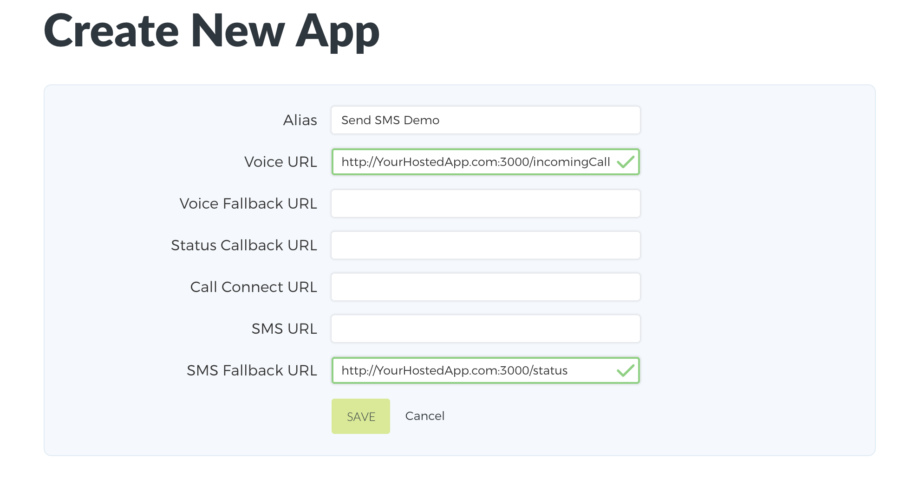
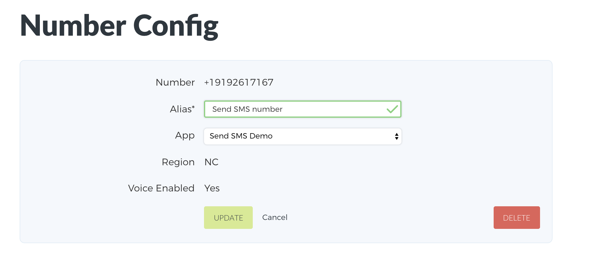

# Hello Persephony

This project serves as a result of following the getting started for Node JS via our documentation. 

## Setting up your new app within your Persephony account

1. After logging into your Persephony account, we will [Get a Persephony Phone Number](https://www.persephony.com/dashboard/portal/numbers/buy). Users will be calling this number to access your app.
2. Next, create a new app using the [Create New App form] setting the alias to `Hello Persepony Demo`(https://www.persephony.com/dashboard/portal/applications/new).

   When a phone call arrives to your Persephony phone number, Persephony will issue an HTTP Request to your application at a given url.

   This tutorial will use the `Voice URL` (with endpoint `/incomingCall`) and `Status Callback URL` (with endpoint `/status`).
   

3. Next, link your Persephony number to your Persephony app. Go to the [My Numbers page](https://www.persephony.com/dashboard/portal/numbers) and click on the number you purchased in Step 1. Set the app to your new Hello Persepony App.
   

## Setting up the Hello Persephony App locally

1. Download and install [Node.js](https://nodejs.org)
2. Install yarn globally [Mac OS](https://yarnpkg.com/lang/en/docs/install/#mac-stable) | [Windows](https://yarnpkg.com/lang/en/docs/install/#windows-stable)
3. Clone or download this repo
4. Install packages
  ```bash
    $ yarn install
  ```

## Using the Hello Persephony App

1. Run the application using command:

   ```bash
   $ node server.js
   Running the application on port 3000.
   ```

2. Add your own code to start creating your own Persephony Application!